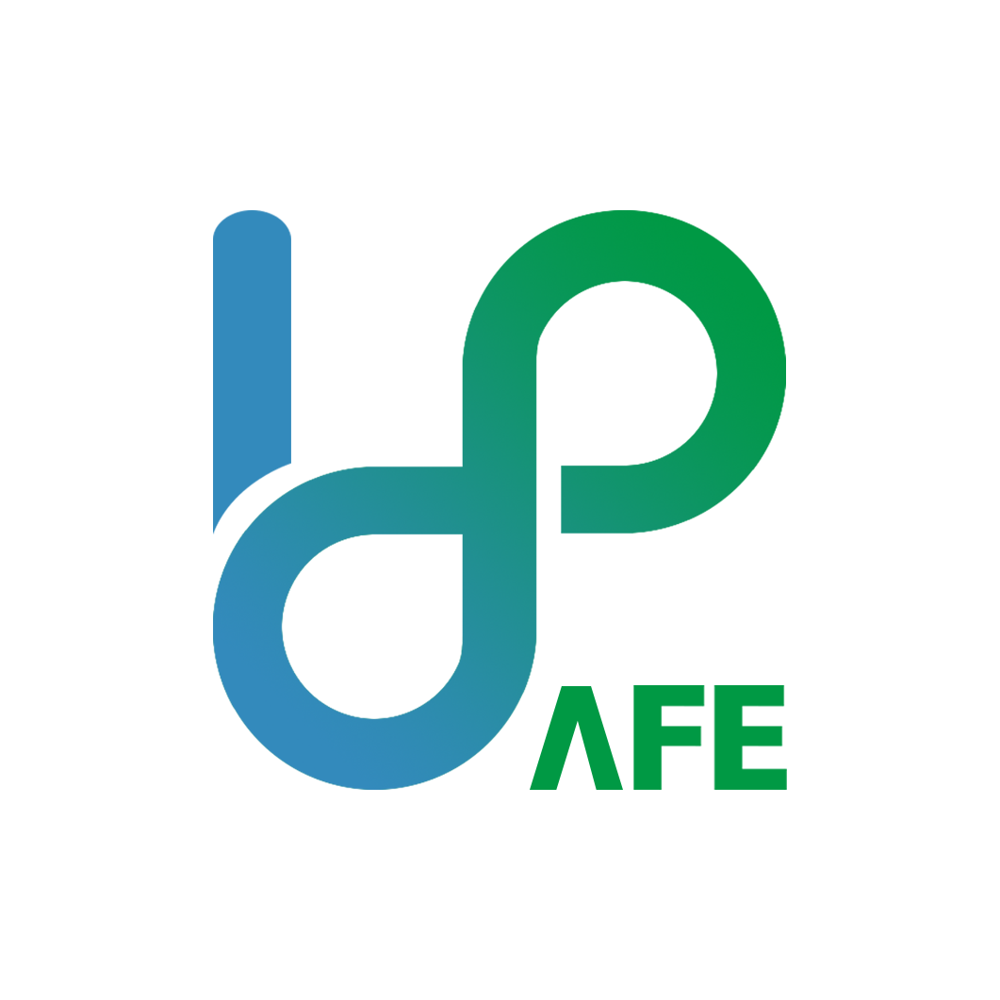

# Bixby-SafeB

## 팀명: 
    tictok

## 프로젝트명: 
    winner

## 캡슐명: 
    세이프비(SafeB) _ 최종 Ver. (3.0.1)

## 캡슐 설명: 
    세이프비는 사용자 위치기반으로 병원, 약국, 긴급 대피소 운영시간, 위치정보를 제공합니다.

## 캡슐 사용법: 
    삼성 갤럭시 사용자 빅스비 홈 -> 마켓플레이스 -> 검색 -> "세이프비" 입력 -> 캡슐추가

## 캡슐 대표 발화:
    hint (세이프비에서 등급 정보가 뭐야)
    hint (세이프비에서 내 위치 어디야)
    hint (세이프비에서 주변 병원 알려줘)
    hint (세이프비에서 주변 병원 등급순서로 알려줘)
    hint (세이프비에서 주변 안과 등급순서로 알려줘)
    hint (세이프비에서 주변 정형외과 알려줘)
    hint (세이프비에서 주변 안과 알려줘)
    hint (세이프비에서 주변 내과 알려줘)
    hint (세이프비에서 근처 약국 알려줘)
    hint (세이프비에서 가까운 대피소 알려줘)
    hint (세이프비에서 가장 가까운 약국 알려줘)
    hint (세이프비에서 가장 가까운 병원 알려줘)
    hint (세이프비에서 가장 가까운 대피소 알려줘)
    hint (세이프비에서 내일 운영하는 병원 알려줘)
    hint (세이프비에서 오늘 운영하는 약국 알려줘)
    hint (세이프비에서 일요일에 하는 병원 알려줘)
    hint (세이프비에서 내일 오후 1시에 운영하는 병원 알려줘)
    hint (세이프비에서 오늘 오전 11시에 운영하는 이비인후과 알려줘)
    hint (세이프비에서 일요일 오후 1시에 운영하는 병원 알려줘)
    hint (세이프비에서 금요일 오후 2시에 운영하는 내과 알려줘)
    hint (세이프비에서 금요일 오전 11시에 운영하는 안과 알려줘)
    hint (세이프비에서 토요일 오전 10시에 운영하는 약국 알려줘)
## 캡슐 아이콘 디자이너: 우가형

## 사용 API 출처
1. 전국 응급의료기관 조회 서비스 : [https://www.data.go.kr/dataset/15000563/openapi.do]

(→이용허락범위 제한없음)

2. 전국 병 의원 찾기 서비스 : [http://apis.data.go.kr/B552657/HsptlAsembySearchService]

(→이용허락범위 제한없음)

3. 병원평가결과정보조회서비스 : [https://www.data.go.kr/dataset/3048126/openapi.do]

(→이용허락범위 제한없음)

4. 병원 정보 서비스 : [https://www.data.go.kr/dataset/15001698/openapi.do]

(→이용허락범위 제한없음)

5. 전국 약국 정보 조회 서비스 : [https://www.data.go.kr/dataset/15000576/openapi.do]

(→이용허락범위 제한없음)

6. 지진해일 긴급대피 장소정보 서비스 : [http://apis.data.go.kr/1741000/TsunamiShelter2]

(→이용허락범위 제한없음)

7. 지진 실내구호소 서비스 : [http://apis.data.go.kr/1741000/EarthquakeIndoors]

(→이용허락범위 제한없음)

## 사용 icons
- 하위 8개 아이콘 모두 [출처] [아이콘 몬스터[https://iconmonstr.com]
- publisher [iconmonstr®Alexander KahlkopfGescherweg 6148161 MünsterGermany]
- 저작권미표시가능
- 1. check-mark.png:
- 2. click-mark.png
- 3. green-marker.png
- 4. map-mark.png
- 5. path-mark.png
- 6. phone-mark.png
- 7. rating.png
- 8. red-marker.png

## 세이프비 메인 로고
- safeb-logo-circle.png: (자체제작) created by 우가형
- safeb-logo.png: (자체제작) created by 우가형
